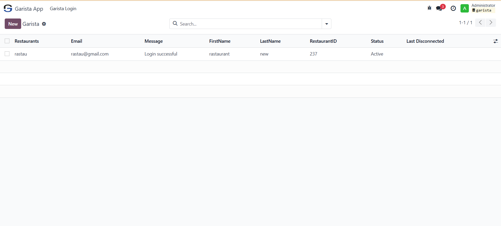

===============
Garista - Odoo POS Sync
===============

**Garista** is an all-in-one digital solution for menu customization, marketing, payment, and order management. This module seamlessly syncs orders from **Odoo POS** to **Garista Order**, along with product categories and pricing.

Features:
---------
- 🔄 **Real-time Order Sync**: Automatically sync orders between Odoo POS and Garista Order.
- 📦 **Product & Category Sync**: Keeps product categories and prices up to date.
- 🏨 **Ideal for Restaurants, Cafés, and Hotels**.

Installation:
-------------
1. Copy the `garista` folder to your Odoo `addons` directory.
2. Restart the Odoo server.
3. Go to **Apps** and search for **Garista**.
4. Click **Install**.

Configuration:
-------------
1. Navigate to **Settings > Garista** and enter your **API URL Path**.
2. Open the **Garista App**, enter your **Garista Account Credentials** (API Token or Username/Password), and click **Connect**.
3. Click the buttons to **Sync All Products, Categories, and Tables** to import items and tables.
4. Enable **Auto-Sync for Orders**.

Privacy & Data Collection:
-------------------------
1. This module syncs POS orders and product data with the Garista app.
2. No personal user data is stored in the module.
3. API requests are made securely over HTTPS.

Usage:
------
1. Open **Odoo POS** and place an order.
2. The order will automatically sync to **Garista Order**.
3. View real-time order status and reports in the Garista dashboard.

Screenshots:
------------
.. image:: static/description/screenshot1.png
   :alt: POS Order Sync

License:
--------
This module is licensed under **LGPL-**
